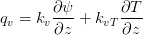
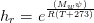

# pyDoubleLayerEB : Double Layer Model for Energy Balance in Bare and Vegetated Surface

Water Flow in Soil due to Infiltration or Evaporation
-----------------------------------------------------
Water flow in soil when there is gradient in soil matric pressure. The gradient could occur through infiltration (water in soil surface) or evaporation flux (vapor movement in soil surface)

**Liquid Flux :**


		

where :
;  = 40.3 ;  = 0.672 ;  = 3.31. The unit of   is depends on the unit of 
Water retention curve is given by equation :
, where  is matric potential in ,  = 0.343;  = 0.04133;  = 5.603;  = 0.8215;  = 0.08624;  = 14.37
water capacity is calculated as  


**Vapor Flux :**

; () - - -> if divided by  (), resulting flux in 


where :
 ; ()

; ()

 is soil relative humidity

;  ( - - -> if divided by 1000, resulting ); 

 = vapor difussivity (0.000024 );  = gas constant (8.3143 );  = mass of a mole water (0.018 );  = temperature (Kelvin);  = air filled porosity

```python
    kvi  = 0.66 * phi_i * Dv * (Mw / (R * (Ti[i] + 273))) * rhov_i  ## Dv, Mw inputted in spreedsheet
    kvTi = 0.66 * phi_i * Dv * drhov_sati * eta * hbar_i
    kvn  = 0.66 * phi_n * Dv * (Mw / (R * (Tn[i] + 273))) * rhov_n
    kvTn = 0.66 * phi_n * Dv * drhov_satn * eta * hbar_n
```
	

Heat Flow in Soil
-----------------
Heat flow in soil occures due to the existance of heat source. Soil surface explosed to solar radiation is the heat source.

Single Layer Energy Balance
---------------------------
Single layer energy balance assumes soil and plant are 1-layer that release vapor to air. Both evaporation (E) and transpiration (T) calculated as ET. Penman-Monteith equation is used to draw the relation.

```python
def PenmanMonteith_ETo(u, Ta, Twb, ha, Rn, Go):
    lamda = LatentHeatVaporize(Ta)
    e_sat, de_sat = SVP(Ta)   
    e_act = AVP(Ta, Twb, alt)
    VPD = e_sat - e_act   
    Pa = AtmPressure(alt)
    gamma = PsycConstant(Pa, Ta)
    rho_a = AtmDensity(Pa, Ta)     
    u2 = u * (4.87)/(np.log(67.8*ha - 5.42))
    raa = 208./u2 				   ## aerodynamic resistance (s/m)
    rca = 30 ## daytime = 50 (short plant <0.5 m), 30 (tall plant > 0.5), nighttime = 200 (s/m)
    PenmanMonteith_ETo = (1/lamda) * (de_sat * (Rn - Go) +  (VPD * rho_a * Cp)/raa)/(de_sat + gamma * (1+(rca/raa)))
    return PenmanMonteith_ETo
## end Penman-Monteith ET calculation
```

Penman-Monteith equation take soil and canopy as isothermal. First term of the eqiauation considering soil surface that requires Net Radiatin (R_n) and Ground Heat Flux (G_o). Second term of equation is about vapor transport from canopy that depends on canppy resistance (rca) and aerodynamic resistance (raa)

Double Layer Energy Balance
---------------------------

